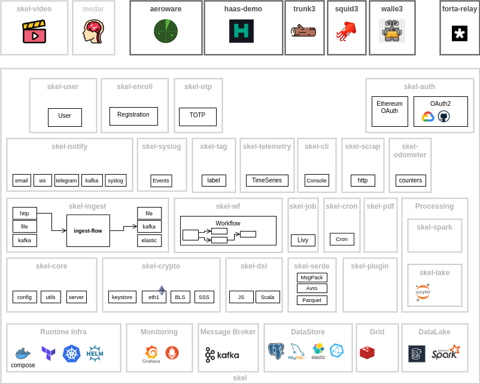

# skel

Prototyping Framework for Cloud Products

* [infra](infra) - Infrastructure (docker,kubernetes)
* [skel-http](skel-http) - HTTP Service (+ Kubernetes)
* [skel-auth](skel-auth) - Authentication/Authorization (IDP for Web3)
* [skel-user](skel-user) - UserProfile Service reference
* [skel-notify](skel-notify) - Notification Service
* [skel-enroll](skel-enroll) - Registration Flow
* [skel-syslog](skel-syslog) - Auditlog service (Cloud syslog)
* [skel-kafka](skel-kafka) - Kafka Processors (Source/Sink)
* [skel-ingest](skel-ingest) - Data Ingestion with Prometheus telemerty reference
* [skel-telemetry](skel-telemetry) - TimeSeries Service + Prometheus/InfluxDB/Graphite/Loki/Grafana infra
* [skel-db](skel-db) - DB Related stuff
* [skel-otp](skel-otp) - OTP Service reference service 
* [skel-test](skel-test) - Test helpers
* [skel-crypto](skel-crypto) - Cryptography and Ethereum utilities
* [skel-spark](skel-spark) - Spark tools
* [skel-datalake](skel-datalake) - Datalake and Warehouses (+ Notebooks)
* [skel-flow](skel-flow) - Streaming DataFlows (Workflows -> [skel-wf](skel-wf))
* [skel-scrap](skel-scrap) - Scraping pipelines
* [skel-cli](skel-cli) - Shell command line client
* [skel-cron](skel-cron) - Cron engine
* [skel-serde](skel-serde) - Serializers
* [skel-video](skel-video) - Movie Metadata processors
* [skel-stream](skel-stream) - Akka Steams 
* [skel-pdf](skel-pdf) - PDF Utils
* [skel-tag](skel-tag) - Tags searchable service (e.g. labels, tags)
* [skel-wf](skel-wf) - Workflow Engine (long running jobs/tasks with complex steps)
* [skel-odometer](skel-odometer) - Counters Datastore
* [skel-plugin](skel-plugin) - Experiments with plugins

----
## Build & Run

Go to [skel-http](skel-http) for Building and Running generic skel component.

Refer to specific demo for running Kubernetes Deployments or Docker-Compose topologies

----

## Demos

- [https://github.com/syspulse/skel-demo](https://github.com/syspulse/skel-demo) for demo projlets

----
## Libraries and Credits

0. Akka: [https://akka.io/](https://akka.io/)
1. Akka-HTTP [https://doc.akka.io/docs/akka-http/current/index.html](https://doc.akka.io/docs/akka-http/current/index.html)
2. Akka-Streams
3. Metrics (Prometheus): [https://github.com/RustedBones/akka-http-metrics](https://github.com/RustedBones/akka-http-metrics)
4. OpenAPI (Swagger): [https://github.com/swagger-akka-http/swagger-akka-http](https://github.com/swagger-akka-http/swagger-akka-http)
5. UUID: [https://github.com/melezov/scala-uuid](https://github.com/melezov/scala-uuid)
6. Args: [https://github.com/scopt/scopt](https://github.com/scopt/scopt)
7. Configuration: [https://github.com/lightbend/config](https://github.com/lightbend/config)
8. Logging: [http://logback.qos.ch](http://logback.qos.ch)
9. JDBC: Quill [https://getquill.io](https://getquill.io)
10. Kafka: Alpakka [https://github.com/akka/alpakka](https://github.com/akka/alpakka)
11. InfluxDB Stream: Alpakka [https://github.com/akka/alpakka](https://github.com/akka/alpakka)
12. InfluxDB Java Client: [https://github.com/influxdata/influxdb-client-java](https://github.com/influxdata/influxdb-client-java)
13. Geohash: [https://github.com/davidallsopp/geohash-scala](https://github.com/davidallsopp/geohash-scala)
14. Quartz: [http://www.quartz-scheduler.org](http://www.quartz-scheduler.org)
15. Web3: [https://github.com/web3j/web3j](https://github.com/web3j/web3j)
16. BLS: [https://github.com/ConsenSys/teku](https://github.com/ConsenSys/teku)
17. elastic4s: [https://github.com/sksamuel/elastic4s]
18. akka-quartz-scheduler: [https://github.com/enragedginger/akka-quartz-scheduler]

Other libraries are referenced in corresponding modules
