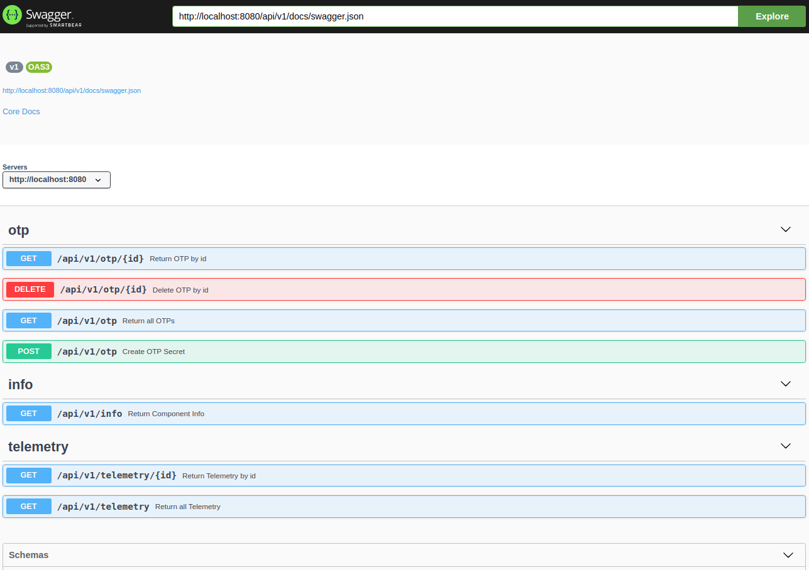

# skel

Skeletons for RnD Prototypes

1. skel-http (with DB support)
2. skel-kafka

## Build & Run

__Dev__
```
sbt
~reStart
```

__Fat jar__
```
sbt assembly
./run.sh
```

__Docker__
```
sbt docker:publishLocal
./run-docker.sh
```
__ATTENTION__: Disable firewall for connection to docker0 (172.17.0.1) from Container -> Host connections (e.g. Container -> Host(MySql):3306)

## Configuration

A lot of flexibility (may be too much) to pass configuration

Configuration reading priority can be customized. Default:

1. Command Line arguments
2. Environment Variables (easiest to pass into Docker)
3. JVM properties
4. HOCON style Typesafe configuration file (application.conf). 
   Configuration file can be customized with __$SITE__ to choose specific site/environment (e.g. __SITE=tidb__ would load __application-tidb.conf__)
   Default File location is __conf/__

__Example__:

```
run.sh --host 0.0.0.0 --port 8080
```

```
HOST=0.0.0.0 PORT=8080 run.sh
```

```
OPT="-Dhost=0.0.0.0 -Dport=8080" run.sh
```

application.conf
```
host=0.0.0.0
port=8080
```

## Logging

Logging is configured with logback.xml:

1. logback.xml is searched on classpath
1. __conf/logback.xml__ is first on Classpath in __run.sh__
2. Default embedded logger config is set to "off"

### Telemetry API

Exposes Metrics Telemetry information

- [http://{host}:{port}/api/v1/telemetry](http://{host}:{port}/api/v1/telemetry) - get all Telemetry
- [http://{host}:{port}/api/v1/telemetry/{metric}](http://{host}:{port}/api/v1/telemetry/{metric}) - get specific Telemetry metric


### Info API

Exposes Service information and Health check

- [http://{host}:{port}/api/v1/info](http://{host}:{port}/api/v1/info)


### OpenAPI Spec

Embedded API documentation

__API spec__: [http://{host}:{port}/api/v1/doc/swagger.yaml](http://{host}:{port}/api/v1/doc/swagger.yaml) or [http://{host}:{port}/api/v1/doc/swagger.json](http://{host}:{port}/api/v1/doc/swagger.json)

Quick: [http://localhost:8080/api/v1/doc/swagger.json](http://localhost:8080/api/v1/doc/swagger.json)

__Swagger UI__: [http://host:port/api/v1/swagger](http://host:port/api/v1/swagger)

Quick: [http://localhost:8080/api/v1/swagger](http://localhost:8080/api/v1/swagger)



----

## Libraries

1. HTTP: Akka-HTTP [https://doc.akka.io/docs/akka-http/current/index.html](https://doc.akka.io/docs/akka-http/current/index.html)
2. Metrics: [https://github.com/erikvanoosten/metrics-scala](https://github.com/erikvanoosten/metrics-scala)
3. OpenAPI (Swagger): [https://github.com/swagger-akka-http/swagger-akka-http](https://github.com/swagger-akka-http/swagger-akka-http)
4. UUID: [https://github.com/melezov/scala-uuid](https://github.com/melezov/scala-uuid)
5. Args: [https://github.com/scopt/scopt](https://github.com/scopt/scopt)
6. Configuration: [https://github.com/lightbend/config](https://github.com/lightbend/config)
7. Logging: [http://logback.qos.ch](http://logback.qos.ch)
8. JDBC: Quill [https://getquill.io](https://getquill.io)
9. Kafka: Alpaka (Akka-Streams)

