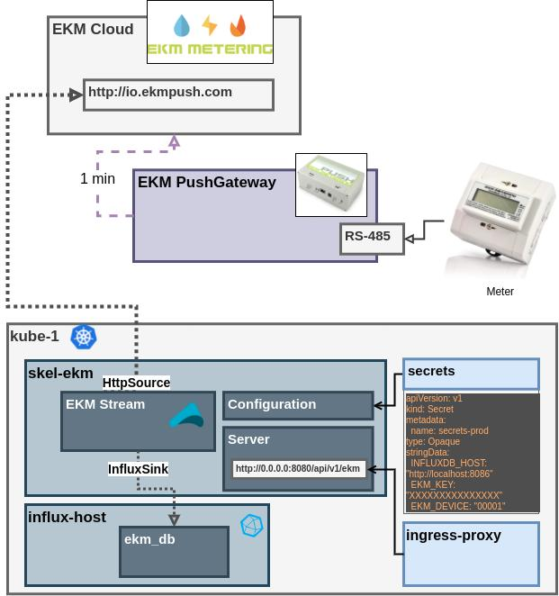
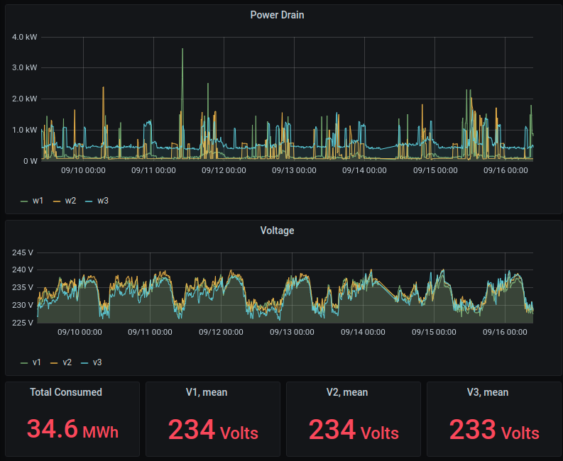
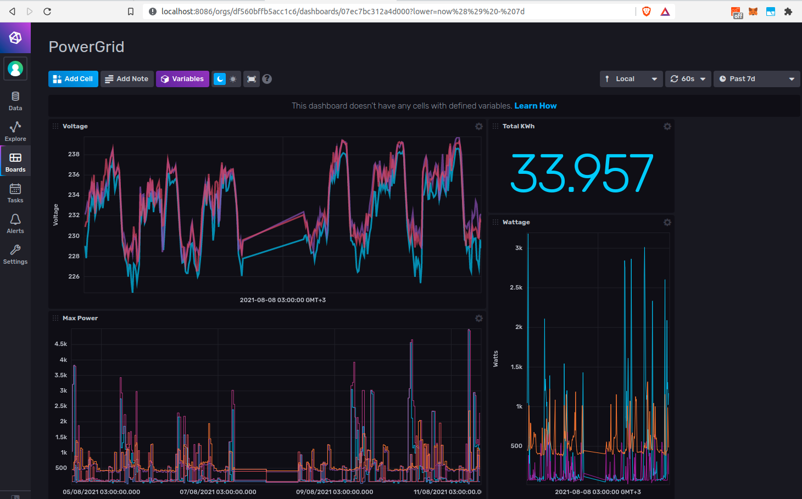

# skel-ekm

Telemetry Collection Flow Reference Implementation for EKM 

## Architecture

Why such simple architecutre diagram ? Need some practive with draw.io to speed up drawing skills

----

## Kubernetes Deployment

[kube](kube)
- secrets-{env}.yaml
- configmap-{env}.yaml
- deployment-{env}.yaml

----

## Visualization

### Grafana dashboard:

### InfluxDB dashboard:

