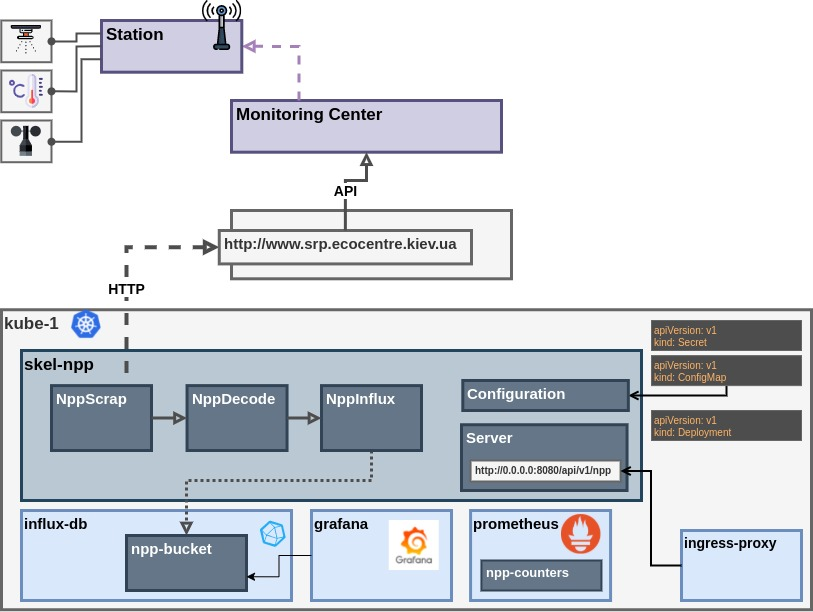
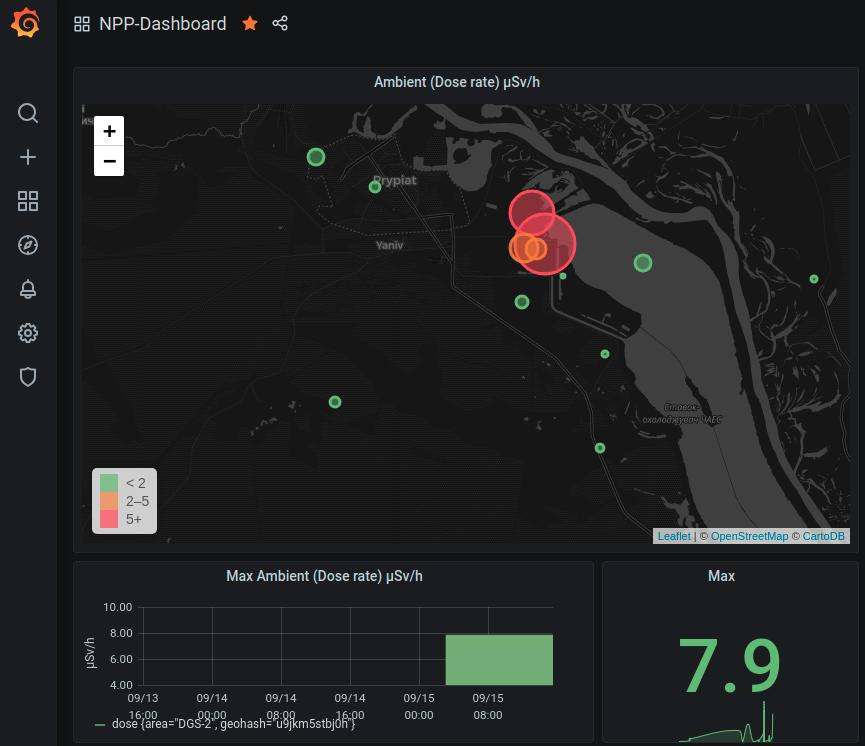

# skel-npp

Dose Radiation Telemetry Collection via Scrapping Ingestion Pipeline 

The data is collected from site which monitors and publishes Chornobyl Power Plant exclusion area.

__Ingestion__ is multiple stages Pipeline:
1. __Scrap__ (scraping data from Website)
2. __Decode__ (decoding scrapped data)
3. __Store__ (storing data in Datastores)

Refer to [skel-flow](../../skel-flow) for the Pipeline design and rationale description

## Architecture

----

## Kubernetes Deployment

[kube](kube)
- secrets-{env}.yaml
- configmap-{env}.yaml
- deployment-{env}.yaml

----

## Visualization

### Grafana dashboard:

----

### Links

- [Chornobyl Power Plant](https://chnpp.gov.ua/en/home)
- [http://www.srp.ecocentre.kiev.ua/](http://www.srp.ecocentre.kiev.ua/)

