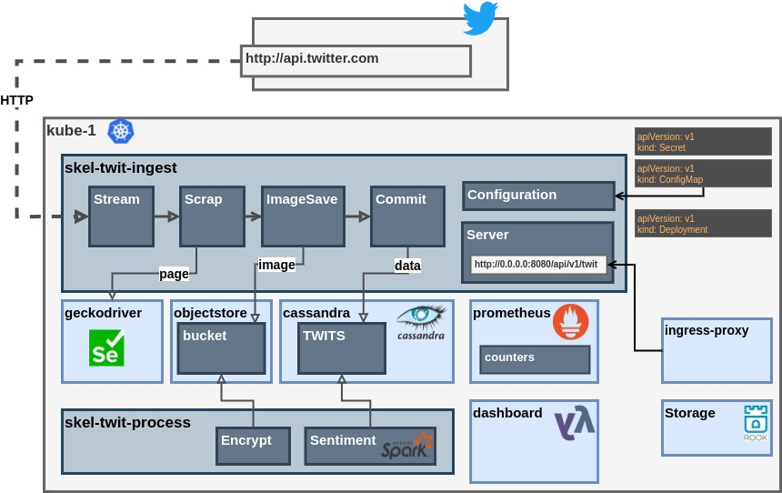
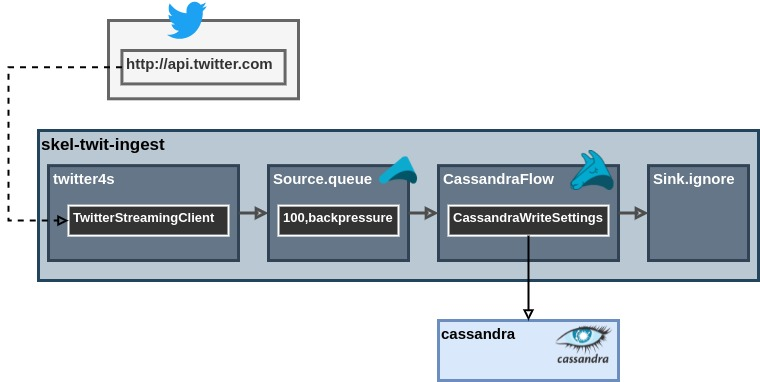

# skel-twit

Reactive Twitter Post and Images Scraper

## Architecture



Why such simple architecutre diagram ? Need some practive with draw.io to speed up drawing skills

----

## Cassandra Setup

```sql
CREATE KEYSPACE twit_space WITH replication = {'class': 'SimpleStrategy', 'replication_factor': '1'}  AND durable_writes = true;
CREATE table twit_space.twit(id bigint PRIMARY KEY, ts bigint, user text, txt text);  
INSERT INTO twit_space.twit(id, ts, user, txt) VALUES (1, 30000000, 'user1','test text');
exit;
```
----

## Akka Stream



