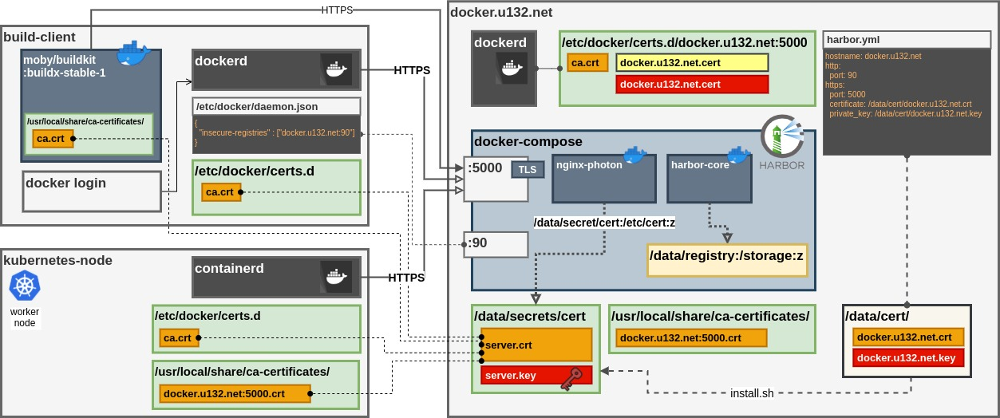

# Harbor Private Docker Regisrty 

__2.3.0__: [https://goharbor.io/docs/2.3.0](https://goharbor.io/docs/2.3.0)



----

## Installation

## Harbor

0. Download and unpack off-line installation

```
bash $ tar xzvf harbor-offline-installer-version.tgz
```

1. Edit __harbor.yml__

```
hostname: docker.u132.net
http:
  port: 90
https:
  port: 5000
  certificate: /data/cert/docker.u132.net.crt
  private_key: /data/cert/docker.u132.net.key
...
```
__NOTE__: Change DB credentials !


2. Generate CA and Certificate

Ref:[https://goharbor.io/docs/2.3.0/install-config/configure-https/](https://goharbor.io/docs/2.3.0/install-config/configure-https/)

Use [harbor-cert.sh](harbor-cert.sh)

```
sudo ./harbor-cert.sh docker.domain.net MilkyWay Org1
```

Or manually:

```
openssl genrsa -out ca.key 4096
openssl req -x509 -new -nodes -sha512 -days 3650 \
 -subj "/C=CN/ST=Andromeda/L=Andromeda/O=syspulse/OU=Personal/CN=docker.u132.net" \
 -key ca.key \
 -out ca.crt

openssl genrsa -out docker.u132.net.key 4096

openssl req -sha512 -new \
    -subj "/C=CN/ST=Andromeda/L=Andromeda/O=syspulse/OU=Personal/CN=docker.u132.net" \
    -key docker.u132.net.key \
    -out docker.u132.net.csr

cat > v3.ext <<-EOF
authorityKeyIdentifier=keyid,issuer
basicConstraints=CA:FALSE
keyUsage = digitalSignature, nonRepudiation, keyEncipherment, dataEncipherment
extendedKeyUsage = serverAuth
subjectAltName = @alt_names

[alt_names]
DNS.1=docker.u132.net
DNS.2=u132.net
DNS.3=docker
EOF

openssl x509 -req -sha512 -days 3650 \
    -extfile v3.ext \
    -CA ca.crt -CAkey ca.key -CAcreateserial \
    -in docker.u132.net.csr \
    -out docker.u132.net.crt

cp docker.u132.net.crt /data/cert/
cp docker.u132.net.key /data/cert/

openssl x509 -inform PEM -in docker.u132.net.crt -out docker.u132.net.cert

cp docker.u132.net.cert /etc/docker/certs.d/docker.u132.net:5000/
cp docker.u132.net.key /etc/docker/certs.d/docker.u132.net:5000/
cp ca.crt /etc/docker/certs.d/docker.u132.net:5000/
```

3. Run install.sh

```
sudo ./install.sh
```

It should automatically start docker-compose

----
## Client Side:

1. Import Certificate
```
mkdir -p /etc/docker/certs.d/docker.u132.net\:5000/
cd /etc/docker/certs.d/docker.u132.net\:5000/
openssl s_client -showcerts -connect docker.u132.net:5000 < /dev/null | sed -ne '/-BEGIN CERTIFICATE-/,/-END CERTIFICATE-/p' >ca.crt
```

2. Check it is accepted
```
curl -i --cacert /etc/docker/certs.d/docker.u132.net\:5000/ca.crt https://docker.u132.net:5000
```

3. Update buildx image (because it connects to registry and does not know anything about local certificates)

Source: [https://github.com/docker/buildx/issues/80](https://github.com/docker/buildx/issues/80)

```
BUILDER=$(sudo docker ps | grep buildkitd | cut -f1 -d' ')
sudo docker cp ca.crt $BUILDER:/usr/local/share/ca-certificates/
sudo docker exec $BUILDER update-ca-certificates
sudo docker restart $BUILDER
```

4. Optionally, import into JVM chain:
```
keytool -importcert -alias 'docker.u132.net:5000' -cacerts -file /usr/local/share/ca-certificates/docker.u132.net\:5000.crt
```

---

## Issues

1. __x509: certificate signed by unknown authority__

Certificate must be visible to all "clients":

* Certificate must be PEM

* OS (Ubuntu):
```
/usr/local/share/ca-certificates/ca.cert
sudo update-ca-certificates
```

* Docker:

```
/etc/docker/certs.d/docker.u132.net:5000/ca.cert
sudo docker restart
```

* If nothing works:

```
/etc/docker/daemon.json:
{
   "insecure-registries" : [ "docker.u132.net:5000" ]
}
```
