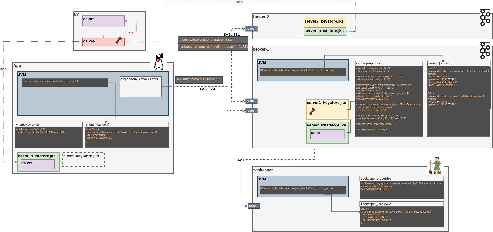

# Kafka Infra

## Confluent.io Kafka

1. [docker-compose-confluent-1.yml](docker-compose-confluent-1.yml) - Confluent Cluster 1-Broker
2. [docker-compose-confluent-2.yml](docker-compose-confluent-2.yml) - Confluent Cluster 2-Brokers
3. [docker-compose-confluent-connect-3.yml](docker-compose-confluent-connect-3.yml) - Confluent Cluster with 3 Kafka-Connect Nodes

## Secure Kafka 

Based on bitnami images ([https://hub.docker.com/r/bitnami/kafka](https://hub.docker.com/r/bitnami/kafka))

1. [ssl](ssl) - SSL and SASL Kafka

