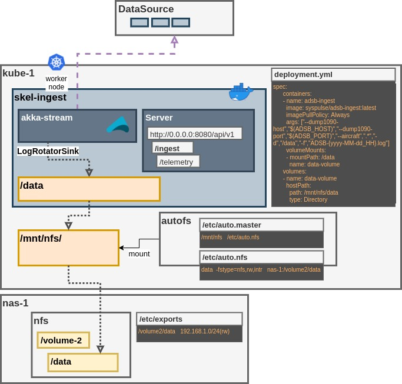
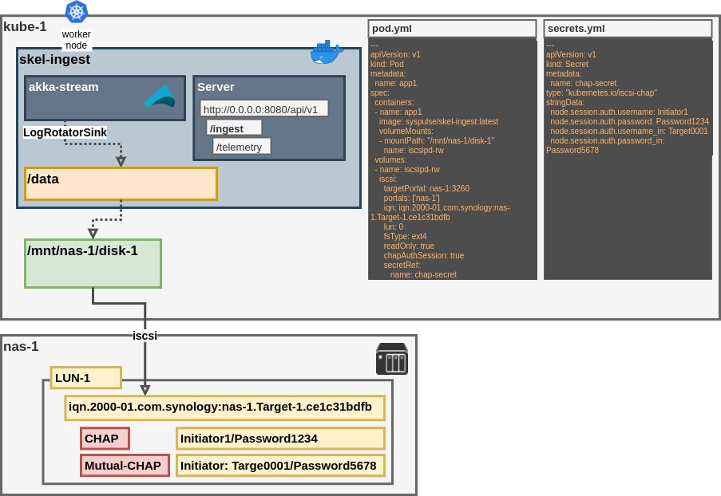

# Kubernetes Infrastructure 

## Interactive

```
kubectl run -it --rm debug --image=ubuntu -- bash
```

```
kubectl run -it --rm debug --image=nicolaka/netshoot -- bash
```

## SSH SOCKS Proxy

SSH server with SOCKS proxy support for tunneling traffic through EKS.

### Deploy

```bash
kubectl apply -f sshd-service-ingress.yaml
```

Wait for the LoadBalancer to be created (may take 1-2 minutes):

```bash
kubectl get svc -n ingest sshd-proxy-service-lb
```

### Get DNS Name

Get the AWS NLB hostname:

```bash
kubectl get svc -n ingest sshd-proxy-service-lb -o jsonpath='{.status.loadBalancer.ingress[0].hostname}'
```

Example output: `k8s-ingest-sshdpr-xxxxx.us-east-1.elb.amazonaws.com`

**Optional:** Create a Route53 DNS record pointing to this hostname for a custom domain.

### Get Password

```bash
kubectl logs -n ingest sshd-proxy | grep "Root password"
```

### Start SOCKS Tunnel

Connect and start the SOCKS proxy tunnel:

```bash
ssh -D 127.0.0.1:1090 -N -o StrictHostKeyChecking=no -o UserKnownHostsFile=/dev/null root@<nlb-hostname>
```

Replace `<nlb-hostname>` with the hostname from the "Get DNS Name" step.

The tunnel will run in the foreground. To run in background, add `-f` flag:

```bash
ssh -D 127.0.0.1:1090 -N -f -o StrictHostKeyChecking=no -o UserKnownHostsFile=/dev/null root@<nlb-hostname>
```

**Configure your browser/app to use SOCKS5 proxy:**
- Host: `localhost`
- Port: `1090`

### Stop

Delete all resources:

```bash
kubectl delete -f sshd-service-ingress.yaml
```

Or delete individual resources:

```bash
kubectl delete pod sshd-proxy -n ingest
kubectl delete svc sshd-proxy-service sshd-proxy-service-lb -n ingest
```

### Troubleshooting

Check pod status:
```bash
kubectl get pods -n ingest
kubectl describe pod -n ingest sshd-proxy
```

Check service status:
```bash
kubectl describe svc -n ingest sshd-proxy-service-lb
```

View logs:
```bash
kubectl logs -n ingest sshd-proxy
```

## [nfs](nfs) - Shared NFS volume Deployment



----

## [iscsi](iscsi) - iSCSI volume Deployment



---
