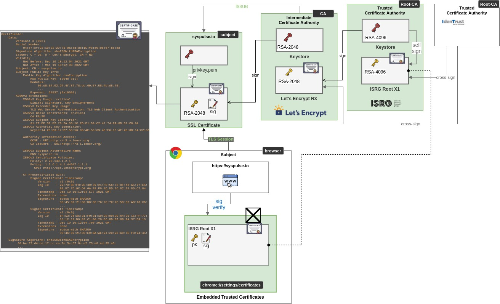

# skel-crypto

Cryptography collection

__NOTE__: for PoC and prototyping

1. [eth-openssl](eth-openssl) - OpenSSL ECDSA Keys for Ethereum
2. [eth-keystore](eth-keystore) - Ethereum Keystore
3. [keccak](keccak) - Keccak256 tool

----

## Tools

### keystore

Generate Eth1 keystore.json with SK = 0x01
```
./run-keystore.sh write -k 0x01
```

Generate Eth1 keystore.json with mnemomnic
```
./run-keystore.sh write -k 'word1 ... word24'
```

Generate Eth2 keystore.json with mnemomnic
```
./run-keystore.sh write -t eth2 -k 'word1 ... word24'
```

Sign Metamask style

```
./run-keystore.sh sign -k 0x1da6847600b0ee25e9ad9a52abbd786dd2502fa4005dd5af9310b7cc7a3b25db test
```

Recover Public Key from Metamask sig

```
./run-keystore.sh recover -k 0x1da6847600b0ee25e9ad9a52abbd786dd2502fa4005dd5af9310b7cc7a3b25db 0x2c11b15223fa3d9f8320049dc1a576f4c55bd40a3bd3b9760f5cf1a608c8a55a43d0315421a39451e13f23767a1a1f4c2b1d7544fdaf9da5ac94982410e61aa81c test
```

----
## Certificates

### SSL Certificates Architecture



