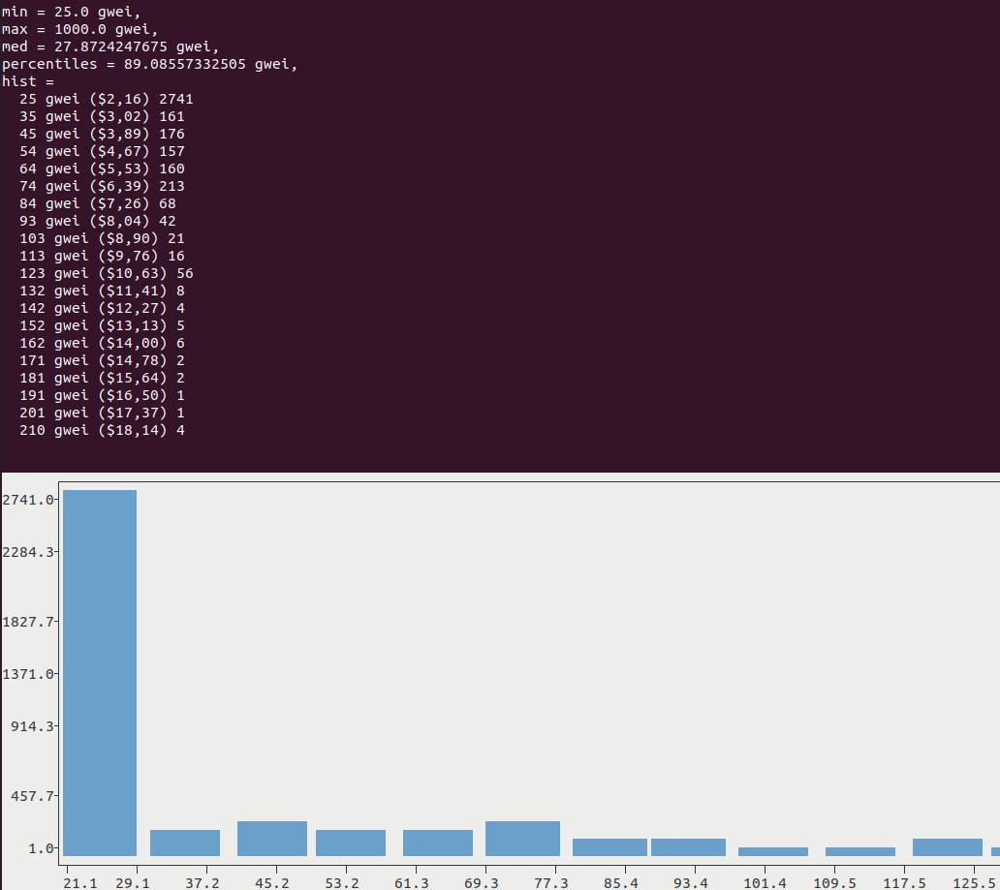

# gas

Gas utilities

----

## Show Gas distribution based on current Mempool transactions 

It is purely a terminal client which plots bar chart to the console

### Prerequisites

1. [https://github.com/piccolomo/plotext](https://github.com/piccolomo/plotext)
2. [https://pandas.pydata.org/](https://pandas.pydata.org/)
3. [https://github.com/com-lihaoyi/Ammonite](https://github.com/com-lihaoyi/Ammonite)


### Run

```
ETH_NODE=http://127.0.0.1:8545 ./gas.sh
```



