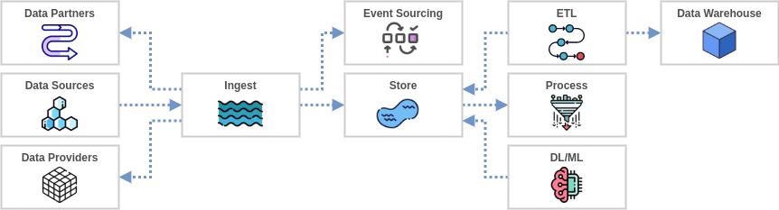
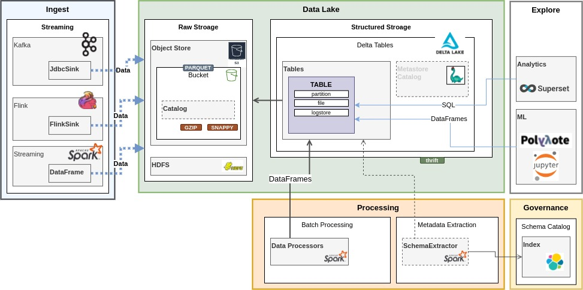
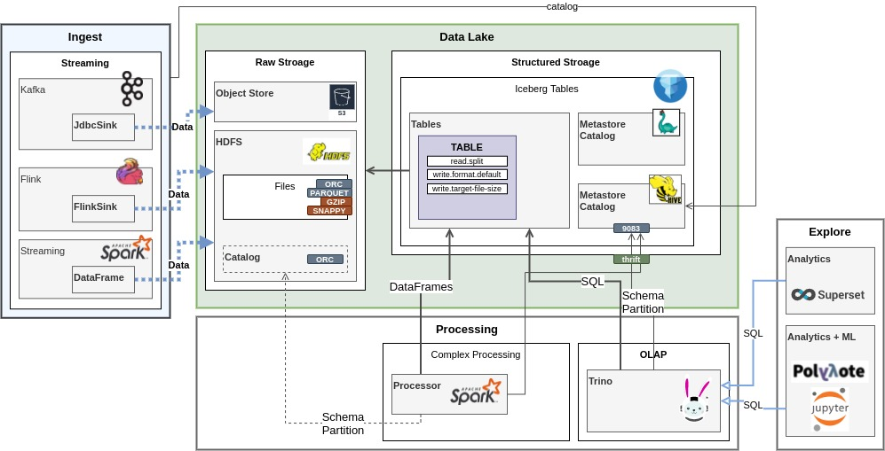

# DataLake Refernce Architecture Snippets

## Generic DataLake Flow

A loе of DataLake projects may look like this from data flow perspective

----

## DeltaLake DataLake

__Components__

1. [Deltalake](https://delta.io) (Structured Datastore)
2. Spark (Lowlevel access to Iceberg tables)
3. Metadata Extractor (Automatic Tables schema). Custome Component
4. SparkStreaming/Flink (Ingest into Iceberg)
5. [Nessie](https://projectnessie.org/tables) (Transactional Catalog)

----
## Iceberg DataLake

__Components__

1. [Iceberg](https://iceberg.apache.org) (Structured Datastore)
2. [Trino](https://trino.io/docs/current/connector/iceberg.html#) (OLAP SQL to Iceberg tables)
3. Spark (Lowlevel access to Iceberg tables)
4. SparkStreaming/Flink (Ingest into Iceberg)
5. [Nessie](https://projectnessie.org/tables) (Transactional Catalog)

