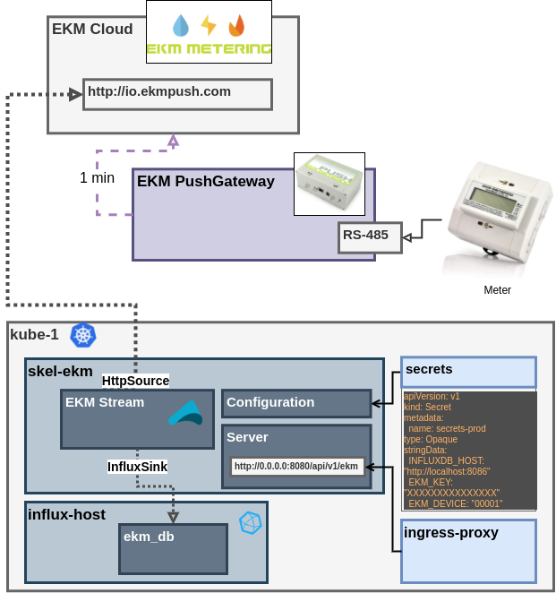
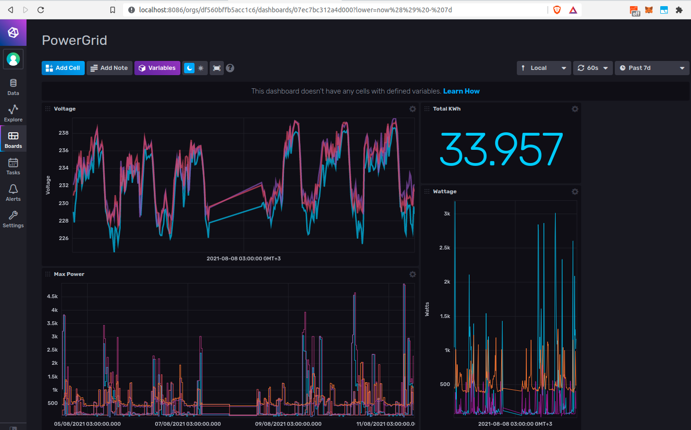

# skel-ekm

Telemetry Collection Flow Reference Implementation for EKM 

## Architecture

Why such simple architecutre diagram ? Need some practive with draw.io to speed up drawing skills

----

## Kubernetes Deployment

- Kubernetes Secrets for sensitive configuration parameter (passed to Docker as args)

## Visualization

InfluxDB visualization dashboard:

