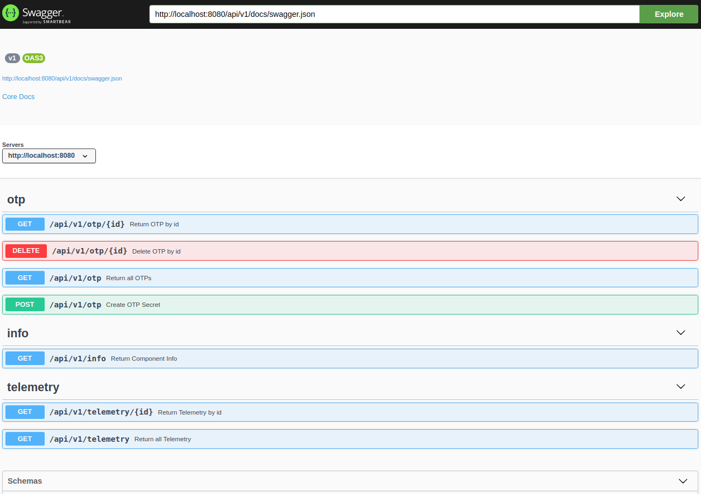

# skel-http

Simple HTTP Service

## Build & Run

### Dev
```
sbt
~reStart
```

### Assembly (Fat jar)
```
sbt assembly
./run.sh
```

### Dependencies (Light jar)

Replace `MODULE` with correct sbt module name. It is expected to be run in project root

```
pushd ..; sbt -error ";project MODULE; export dependencyClasspath" >CLASSPATH; popd; mv ../CLASSPATH ./
./run.sh
```
`CLASSPATH` file will have a precendence, so to run with Fatjar delete `CLASSPATH`


### Docker

Local 
```
sbt docker:publishLocal
../tools/run-docker.sh
```

Publish to [hub.docker.io](hub.docker.io)
```
sbt docker:publish
./run-docker.sh
```
The build will create platform images: __amd64__,__arm64__ (for testing on RP4 clusters)

__NOTE__: Due to RP4, __openjdk8-alpine__ crashes, so migrated to much fatter [openjdk:18-slim](https://hub.docker.com/layers/openjdk/library/openjdk/18-slim/images/sha256-6a92cfcaaf66ea5fac0b7c4b4faecb5ab389485062d3b49670bd792232b36f8b?context=explore)


__ATTENTION__: Disable firewall for connection to docker0 (172.17.0.1) from Container -> Host connections (e.g. Container -> Host(MySql):3306)

----

## Configuration

Configuration parameteres are read with prioriy (from highest to lowest)
If configuration parameter is found for highest priority, the rest will not be read.
Example: 
```HTTP_PORT=8081 run.sh --http.port=8082``` - The environment var will not be even tried because arg was found and arg is the highest priority

__Default Priority__:

1. __Command Line arguments__
2. __Environment Variables__ (easiest to pass into Docker). The convention for env. variable name to replace __'.'__ (Dot) with __'_'__ (Underscore) and upper-case all characters: __http.port__ -> __HTTP_PORT__
3. __JVM properties__ (passed as __OPT='-Dname=value'__ variable to run script)
4. conf/__application.conf__ HOCON style Typesafe configuration file

   Default: __application-*component suffix*>.conf__ 
   
   E.g. __skel-http__ -> __application-http.conf__
   
   Configuration file can be customized with __$SITE__ to choose specific site/environment (e.g. __SITE=dev__ would load __application-dev.conf__)
   
   Default config file location is __conf/__
   
   '.' in configuration path means new section in file. E.g. __http.port__ :

   ```
   http {
      port = 8080
   }
   ```

__ATTENTION__: Docker Image is ALWAYS packaged with __application.conf__. 
Customize __application.conf__ for default Docker configuration.
Docker image will never package __application-*.conf__ and SITE/Component will be ignored when Docker is run. 

### Examples:

Read config from conf/application-http.conf (by default it uses current directory name suffix)
```
run.sh
```

Read config from conf/application-http.conf and override DB Url
```
DB_DATASOURCE_URL='jdbc:mysql://rigel.u132.net:3306/otp_db' ./run.sh
```
__NOTE__: Notation DB_DATASOURCE_URL overrides configuration:
```
db {
  dataSource.url="jdbc:mysql://localhost:3306/service_db"
}
```
By default, all services read DB configuration from "db" branch


Read config from conf/application-dev.conf
```
SITE=dev run.sh
```

Read config from conf/application-http.conf and override http.host and http.port
```
run.sh --http.host 127.0.0.1 --http.port 8083
```

Read config from conf/application-http.conf and override with Env variables
```
HTTP_HOST=localhost HTTP_PORT=8084 run.sh
```

Read config from conf/application-http.conf and override with Properties
```
OPT="-Dhttp.host=192.168.1.100 -Dhttp.port=8086" run.sh
```

Read config from conf/application.conf and override with args
```
../tools/run-docker.sh --http.port=8091
```


Exampl of configuration file: __application-dev.conf__

```
include "default-http"
http {
   host=0.0.0.0
   port=8080
}
```
----
## Logging

Logging is configured with logback.xml:

1. logback.xml is searched on classpath
2. __conf/logback.xml__ is first on Classpath in __run.sh__
3. Default embedded logger config is set to "off"
4. Command line option (must be enabled in code): `--log=DEBUG` or `--log=class:DEBUG`

----
## Default API

Default API endpoints in every service 

### Health

- [http://{host}:{port}/api/v1/service/health](http://{host}:{port}/api/v1/service/health) - get very simple OK response

### WebSocket

- [http://{host}:{port}/api/v1/service/ws](http://{host}:{port}/api/v1/service/ws) - Simple Echo websocket


### Telemetry API

Exposes Metrics Telemetry information

- [http://{host}:{port}/api/v1/service/telemetry](http://{host}:{port}/api/v1/service/telemetry) - get all Telemetry
- [http://{host}:{port}/api/v1/service/telemetry/{metric}](http://{host}:{port}/api/v1/service/telemetry/{metric}) - get specific Telemetry metric


### Info API

Exposes Service information and Health check

- [http://{host}:{port}/api/v1/service/info](http://{host}:{port}/api/v1/service/info)


### OpenAPI Spec

Embedded API documentation

__API spec__: [http://localhost:8080/api/v1/service/doc/swagger.yaml](http://localhost:8080/api/v1/service/doc/swagger.yaml) or [http://localhost:8080/api/v1/service/doc/swagger.json](http://localhost:8080/api/v1/service/doc/swagger.json)


__Swagger UI__:

[http://localhost:8080/api/v1/service/doc](http://localhost:8080/api/v1/service/doc)



----
## Kubernetes

[kube](kube) - Kubernetes deployment options

Different options allow to access service over different URI:

1. Default [skel-http-ingress-1.yaml](skel-http-ingress-1.yaml)
```
curl http://k1.home.net/api/v1/service/health
```

2. Ingress pathes [skel-http-ingress-2.yaml](skel-http-ingress-2.yaml)
```
curl http://k1.home.net/service/health
```

3. Explicit path with version [skel-http-ingress-3.yaml](skel-http-ingress-3.yaml)
```
curl http://k1.home.net/api/v2/service/health
```

[skel-http.yaml](skel-http.yaml) - Creates 3 Deployemnts/Services/Ingresses