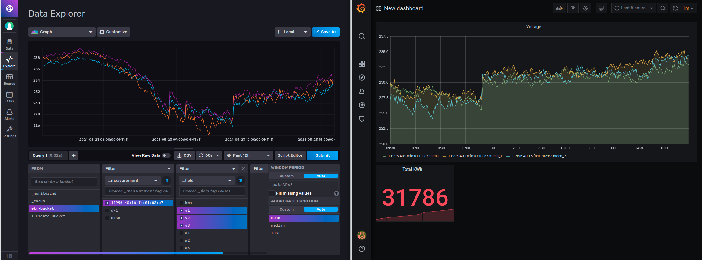

# skel-ingest

Data Ingestion and Collection Flow

## Use Cases

1. Telemetry Data Ingestion

## Data Sinks

1. InfluxDB
2. Graphite
3. LogFiles
4. Stdout

## Telemetry Collection

Prometheus Telemetry

---
## Visualization

Grafana is the primary visualization dashboard

