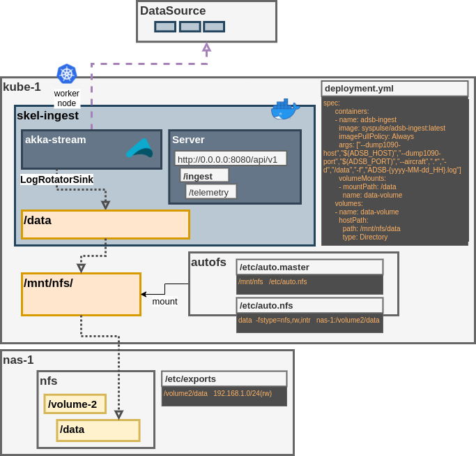

# skel-ingest

Data Ingestion and Collection Flow

## Data Sinks

1. InfluxDB
2. Graphite
3. LogFiles
4. Stdout

## Telemetry Collection

Prometheus Telemetry

----

## NFS Sink on Kubernetes 

Simple shared NFS for Kubernetes Worker nodes. All worker nodes must have NFS mount point configured.
The diagram depicts topology with autofs NFS mount

---
## Prometheus Visualization

Grafana is the primary visualization dashboard

