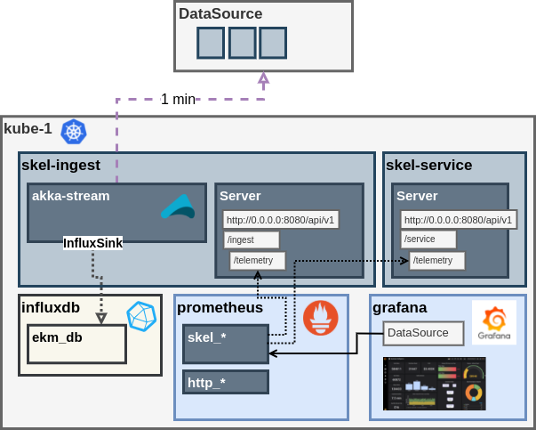
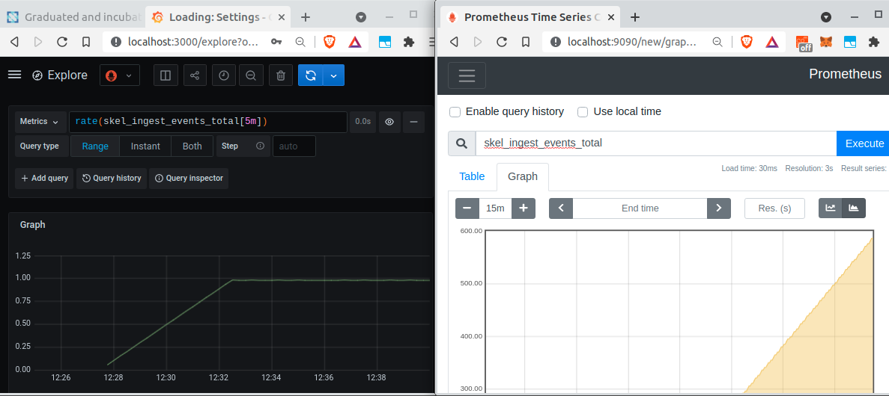

# skel-ingest

- Data Ingestion Flow: [inges-flow](ingest-flow)
- Proxy: [inges-proxy](ingest-proxy)

## Data Ingestion Flow 

All input data is ByteString

All output data is `Ingestable` and must provide `Json` and `Parquet` serializers

__feed__ -> [source] -> [decode] -> [transform] -> [sink] -> __output__

## Input Feeds

1. ```stdin://```                               - from stdin
2. ```http://host:port/api```                   - HTTP Client from remote HTTP server. Mulitple HTTP servers can be used via `,`
3. ```file://dir/file```                        - From single file. This is also default option if uri:// prefix is not used
                                                  Support multiple source with comma: (`http://host1,http://host2`)
4. ```kafka://broker:9092/topic/group/offset``` - From Kafka `offset` == latest,earliest
5. ```dir://dir```                              - From directory (reads all files)
6. ```dirs://dir```                             - From directories (reads all files from all subdirs)
7. ```null://```                                - No source
8. ```tick://inteval://{source}```              - Tick cron. ex: `tick://1000://http://localhost:8300`
8. ```cron://expr://{source}```                 - Crontab cron. ex: `cron://expr://http://localhost:8300`
                                                  `expr` is either configured scheduler name (applicaion.conf) or cron expression
                                                  __NOTE__: because of bash, use this format: `'cron://*/1_*_*_*_*_?'`
9. ```null://```                                - No source
10. ```clock://```                              - Clock ticker (with optional frequency). Similar to `tick` but not source
11. ```server://host:port/path```               - HTTP Server listener (Webhook). Server accepts `POST` and always responds "200" (behaves like webhook)
12. ```tcp://host:port```                       - Tcp client from remote TCP Server
13. ```tail://file```                           - Tail file
14. ```tails://dir```                           - Tail directory for new files
15. ```ws://host:port/path```                   - Websocket Client to remote Websocket server

## Output Feeds

1. ```stdout://```, ```stderr://```                          - std pipes
2. ```file://dir/file```                                     - to single file (time patterns supported)
3. ```hive:///data/{YYYY}/{MM}/{dd}/file-{HH:MM:SS}.log```   - Hive style file (support for subdirs and Time pattern)
4. ```elastic://host:9200/index```                           - To Elastic index
5. ```kafka://broker:9092/topic```                           - To Kafka
6. ```null://```                                             - Sink.ignore
7. ```fs3://```                                              - file without APPEND (S3 object store)
8. ```json://```                                             - Json to stdout (uses Spray to convert to AST and prettyprint)
9. ```csv://```                                              - CSV to stdout
10. ```log://```                                             - Calls toLog on Ingestable
11. ```filenew://```                                         - Generate new file for every event (use time formatters)
12. ```files://```                                           - Limit file by size
13. ```parq://{file}```                                      - Parquet Format file (time patterns supported)
14. ```http://host:port```                                   - HTTP Client to remote HTTP server which accepts `POST`
15. ```jdbc://db```                                          - Exeperimental JDBC (only flat object)
16. ```server:ws://host:port/url```                          - Expose Websocket Server


----

## Telemetry Collection

Prometheus Telemetry




---
## Prometheus Visualization

Grafana is the primary visualization dashboard



