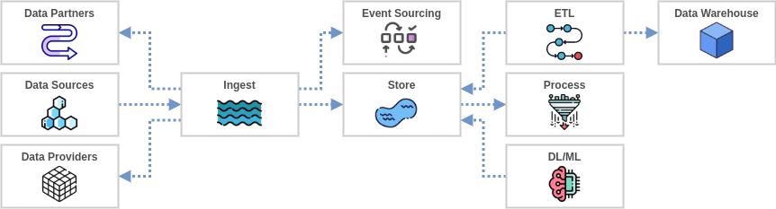
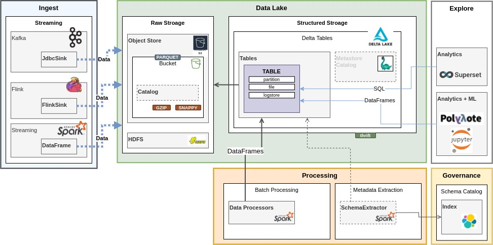
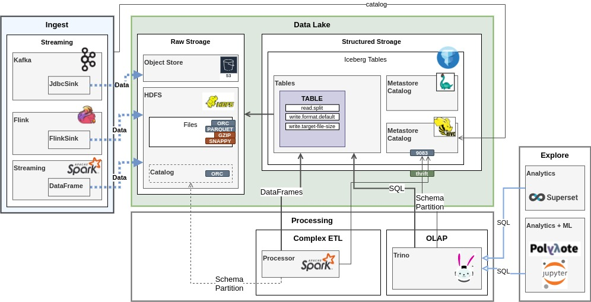
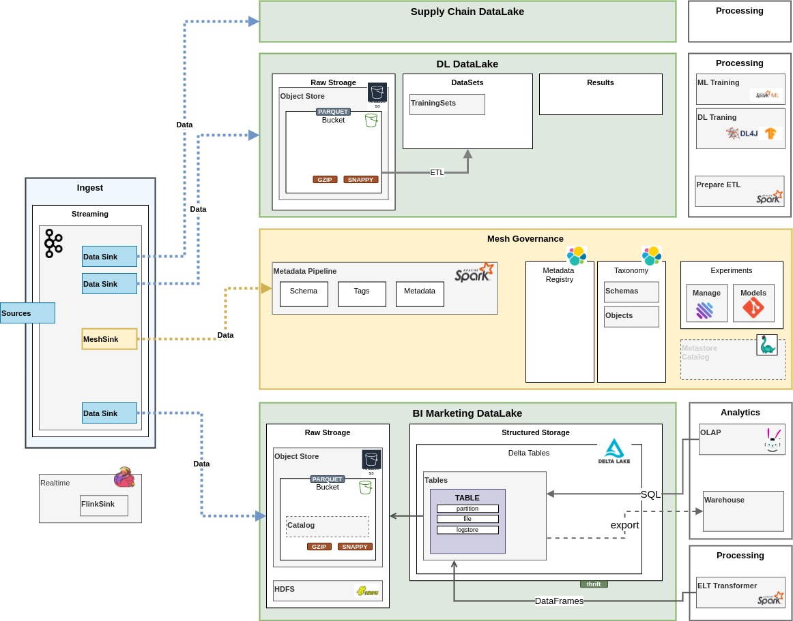

# DataLake Refernce Architecture Snippets

## Notebooks

1. __Mercury__: https://github.com/mljar/mercury

- https://mljar.com/blog/dashboard-python-jupyter-notebook/ 

2. __Viola__: https://github.com/voila-dashboards/voila

## Visualization

- [https://seaborn.pydata.org/]
- [https://altair-viz.github.io/gallery/index.html#example-gallery]

---
## Frameworks and Libraries

- pandas [https://pandas.pydata.org/]
- dask [https://www.dask.org/]
- h3-pandas [https://github.com/DahnJ/H3-Pandas]

----
## Generic Data Flow

A lot of BigDate projects may look like this from data flow perspective

The devil is in the details especially particularly when DL/ML pipelines are invovled

----

## S3

[s3](s3/README.md)

----

## DeltaLake DataLake

__Components__

1. [Deltalake](https://delta.io) (Structured Datastore)
2. Spark (Lowlevel access to Iceberg tables)
3. Metadata Extractor (Automatic Tables schema). Custome Component
4. SparkStreaming/Flink (Ingest into Iceberg)
5. [Nessie](https://projectnessie.org/tables) (Transactional Catalog)

----
## Iceberg DataLake

__Components__

1. [Iceberg](https://iceberg.apache.org) (Structured Datastore)
2. [Trino](https://trino.io/docs/current/connector/iceberg.html#) (OLAP SQL to Iceberg tables)
3. Spark (Lowlevel access to Iceberg tables)
4. SparkStreaming/Flink (Ingest into Iceberg)
5. [Nessie](https://projectnessie.org/tables) (Transactional Catalog)

----
## DataMesh

DataMesh concept is about automated quick deployment of "small" lakes for specifi departments or even tasks under the same Governance

