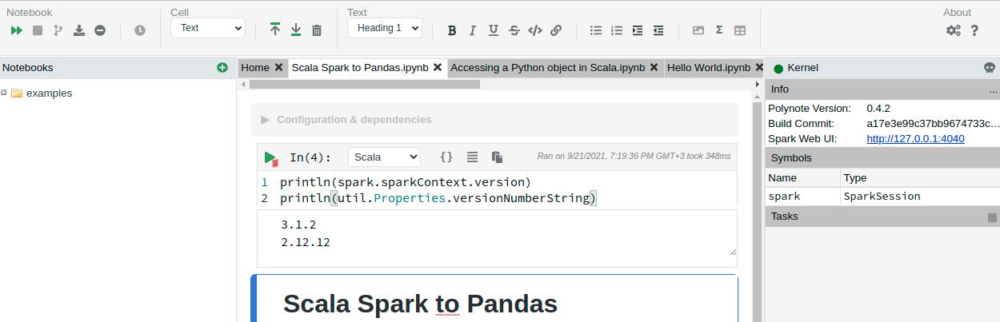

# polynote

Polynote Notebook

## Building Docker with configurable Polynote/Scala/Spark

0. Clone

```
git clone https://github.com/syspulse/polynote
cd polynote
git checkout feature/docker-configurable
```

1. Build Frontent

```
cd polynote-frontend
npm install
npm run dist
```

2. Build Backend

__NOTE__: Frontend must be already built or it will not be packaged !

```
sbt +dist
```
It will build 2.11, 2.12. 2.13 distributes under one tar.gz

3. Prepare Exports
```
export SCALA_VERSION=2.12
export POLYNOTE_VERSION=0.4.2
export SPARK_VERSION=3.1.2
```

4. Build dev image

From project root:

```
./build-docker.sh
```

5. Build image wiith spark 

From project root:

```
./build-docker-spark.sh
```

6. Run docker

Don't forget to create config.yml: [https://github.com/polynote/polynote/docker/README.md](https://github.com/polynote/polynote/docker/README.md)

```
POLYNOTE_SCALA_VERSION=2.12 ./run-docker.sh
```



----

## Credits

1. Polynote: [https://github.com/polynote/polynote](https://github.com/polynote/polynote)
