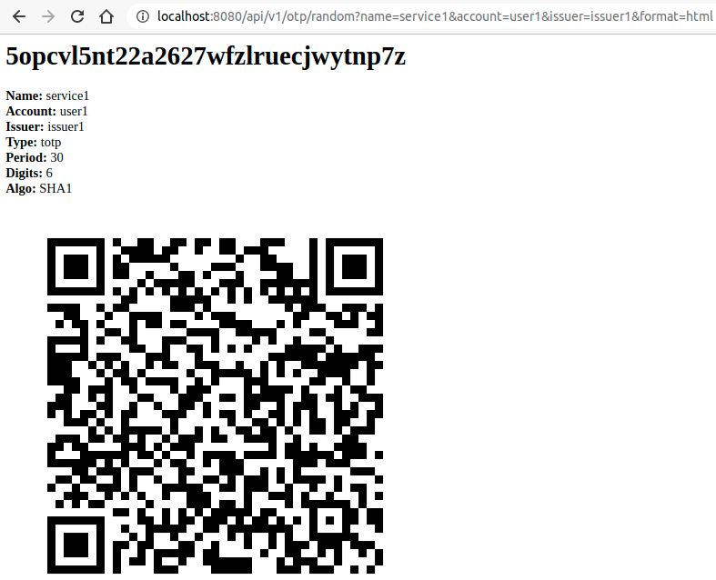

# skel-otp

OTP Service Template

Provides backend for OTP Authentication (e.g.[Goole Authenticator](https://play.google.com/store/apps/details?id=com.google.android.apps.authenticator2))

NOTE: __NOT for PRODUCTION__ Only for testing/prototyping ! 

No authorization and returns all data including *secret*

## Storage

1. MySQL

Setup DB

```
cd db/mysql
../../../skel-db/mysql/db-create.sh
```

2. Postgres

## Usage Example

1. Return Random OTP secret

```
curl -s "http://localhost:8080/api/v1/otp/random?name=service1&account=user1&issuer=issuer1"
```
Returns secret and based64 encoded QR code png

2. Return Random secret as QR code as simple HTML page (for testing)
```
curl -s http://localhost:8080/api/v1/otp/random?name=service1&account=user1&issuer=issuer1&format=html
```



Scan QR or Enter secret in Google Authenticator or [https://freeotp.github.io/](https://freeotp.github.io/)

3. Create OTP from secret for User ID

```
OTP=`./otp-create.sh [secret] | jq -r .id`
echo $OTP
```

Returns OTP id which to verify (NOTE: not bound to user)

4. Verify OTP code

```
./otp-verify.sh [code] $OTP

{"authorized":true,"code":"224716"}
```


## Credits

Excellent libraries used:

1. OTP: [https://github.com/ejisan/kuro-otp](https://github.com/ejisan/kuro-otp)
2. QR: [https://github.com/kenglxn](https://github.com/kenglxn)
